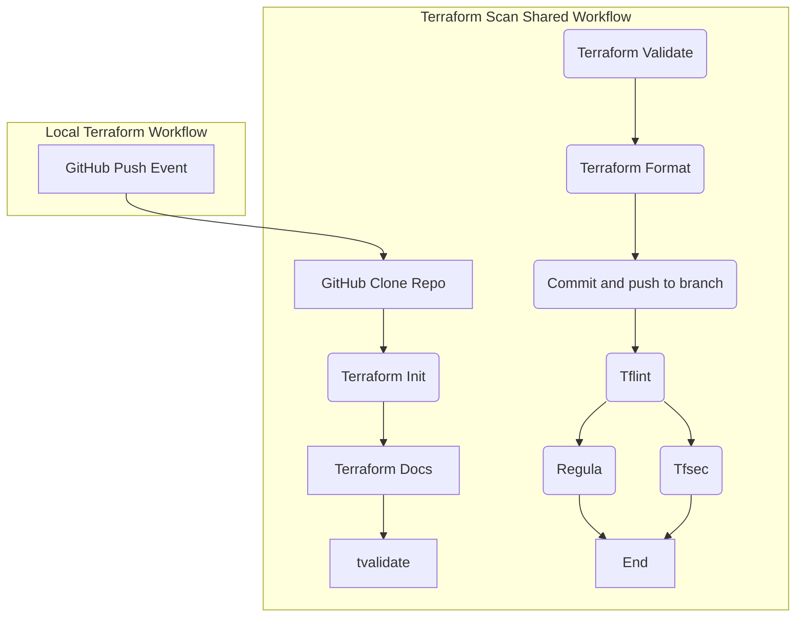

# Lint and Scan

This article will explain how the `.github/workflows/terraform-scan.yaml` operates and how to use the shared workflow. Please note, Terraform linting and security scanning are performed in a single workflow.

## Contents of the Workflow

* **GitHub Actions Workflow Type:** Call
* **Variables:**
  * *soft-fail* 
    * Used by Tfsec. When set to true, vulnerabilities found will not stop the pipeline but still show a report.
  	* required: false
  	* default: false
  	* type: boolean
  * *tf-dirs*
    * Used by Regula, this variable can either be line (heredoc) or space seperated for multiple folders.
    * required: false
    * default: .
    * type:string

*Examples can be found in [Installation and Use](#installation-and-use).*

### Format and Validate

Before Tflint or any scans are run, 2 steps have been added to the format step. Upon a `push` from the repository, an action will run to peform the following steps in order. 

1. `terraform fmt -recursive` will fix spacing and formatting.
1. `terraform validate` will validate Terraform in the repository.
1. Commit and push, all modified files will be commited and pushed to the same branch that triggered the action. 

*Note:* Please remember to run `git pull origin` after this pipeline runs as formatting may have occurred after running `git push origin`.

### [Tflint](https://github.com/terraform-linters/setup-tflint)

This is a Terraform linter that will do a very general look at any files with the `.tf` suffix. The action will report any linting that seems out place with regards to `type` not set properly for a variable for example. This linter will not correct anything for you and will not worry about the format of the Terraform.

The settings for this action are to have compact results and to recursively scan subfolders for any Terraform files included as well.

### [Tfsec](https://github.com/aquasecurity/tfsec-action)

Tfsec is a well known and established Terraform security scanning tool. The parent company is Aqua Security and has been around the industry a while as a leader. The reports simple to read at the end and runs fairly quickly.

### [Regula](https://github.com/fugue/regula-action)

Regula is another impressive scanner that, when configured, can apply additional rules for scanning. Regula must be told what folders to scan (defaul is the repo root folder). Please note, regula is working even though the results may lead to improper assumptions. Regula's stock enforcement will mostly look at known providers and provide scans. Regula seems to be one of the easiest tools to optimize to add or dismiss certain rules when scanning Terraform.

## Installation and Use

Assuming the permissions for the GitHub actions has been set properly (see release documentation). Add the following contents to the file `.github/workspaces/terraform-scan.yaml`.

```yaml
name: Scan Terraform
on:
  push:
  pull_request:

jobs:
  scan-terraform:
    uses: defenseunicorns/uds-common-workflows/.github/workflows/terraform-scan.yaml@main
    with:
      soft-fail: true
      tf-dirs: . examples/complete
```

## Workflow Diagram

Requirements for a succesful workflow are that all jobs must complete succesfully.


