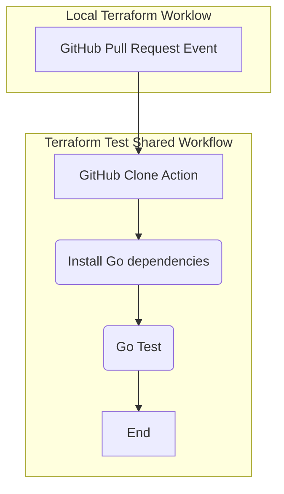

# Terraform-Test

The UDS Commown Workflow for Terraform has agreed to use [Terratest](https://terratest.gruntwork.io/). This testing framework does require the use of and limited knowledge of the [Go programming language](https://go.dev/). The experience needed is not extensive as there should be plenty of examples using Terratest in the Defense Unicorns Terraform repositories. 

For this GitHub Workflow to be utilized properly, a common structure and pattern has been implemented for ensuring this workflow can be reuseable for all related repositories.  Testing is a mandatory feature of all UDS packages and these shared workflows are supplied to ease the use of future development that meets the defined standards of a UDS package.

*Overal Objective:* Provide testing at the repository level. Testing should include a base case and additional tests will be added as needed for common behaviors relied upon downstream from the repository when deemed necessary upon request and review by the team. 

## Workflow Arguments 

* test_retry:
  * required: false
  * description: 'Retry count'
  * default: 1
  * type: number

## Credentials

The team has decided that credentials must be defined at the repository level and not in the shared workflow. This will allow the development team to test in the environment that they need specifically without the common workflow mandating which repository and secrets must be used.

~~To use, make sure when the shared workflow is used that the shared workflow is called with the `secrets: inherit` flag (show in the [example test](#example_tst) section). GitHub has documented [Simplifying using secrets with resuable workflows](https://github.blog/changelog/2022-05-03-github-actions-simplify-using-secrets-with-reusable-workflows/) on how and why.~~

It has been found that `secrets: inherit` is not needed when using a shared action instead of a shared workflow. The reason for using an action is due to the host repository needing to supply the credentials. Workflows cannot call a workflow after calling an action, but a workflow may call multiple actions.

## Repository Structure

The layout required for testing uniformly are specified as followed:
* All Go source files must be in a `test/` folder.
* All Go source code must use the `test_test` module name.
  * Reason: `test` namespace is reserved and a warning will be shown.
* The `go.mod` must reside in the root of the directory. 
  * Necessary as the command `go test -count <count> -v ./...` will be used.
  * The `go.mod` file must be initialized with `go mod init test_test` while in the repositry root directory.
* An `examples/` folder must be created to house the testing terraform of the module. 

## Example Test

Given the knowledge that not every Terraform module is the same in terms of complexity and the complexity of the tests may range from seconds to test to almost an hour. The minimum suggestiong is that all Terraform be able to be tested before a Pull Request is approved and shown in GitHub.

Please research what is best for the specific repository, but an easy target for a baseline for testing is with the `pull_request` event. The reader has flexibility for more specific events in `pull_request` as needed depending the scope of the Terraform to be tested.

```yaml
name: Terraform Test
on:
  pull_request:

defaults:
  run:
    # We need -e -o pipefail for consistency with GitHub Actions' default behavior
    shell: bash -euo pipefail

jobs:
  terraform-test:
    runs-on: ubuntu-latest
    if: github.event.pull_request.draft == false
    steps:
      - name: Configure AWS Credentials
        uses: aws-actions/configure-aws-credentials@v2
        with:
          role-to-assume: ${{ secrets.AWS_COMMERCIAL_ROLE_TO_ASSUME }}
          role-session-name: ${{ github.event.client_payload.pull_request.head.sha || github.sha }}
          aws-region: us-east-1
          # 21600 seconds == 6 hours
          # 1800 seconds == 30 minutes
          role-duration-seconds: 1800

      - name: Run Shared Test workfow
        uses: defenseunicorns/uds-common-workflows/.github/actions/terraform-test@25-common-iac-test
        with:
          test_retry: 1
```

## Workflow Diagram

For the workflow to complete, all steps must complete successfully.


